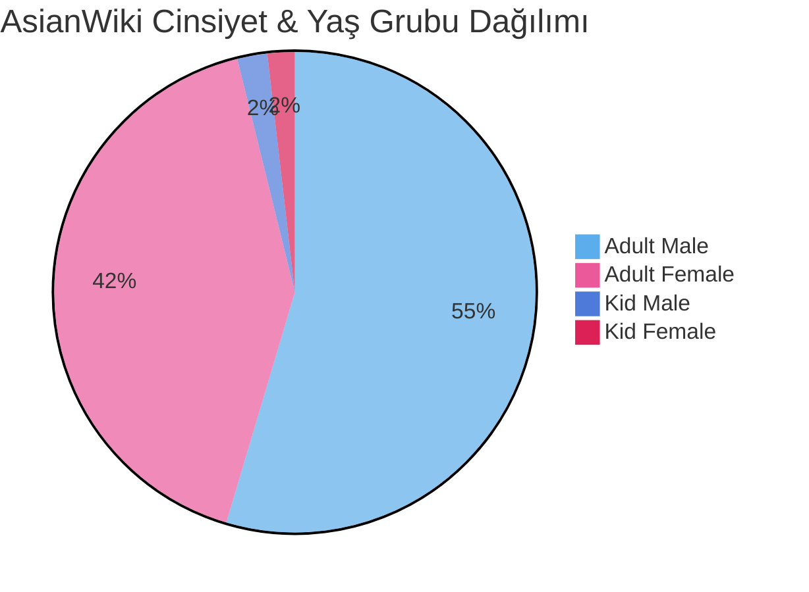
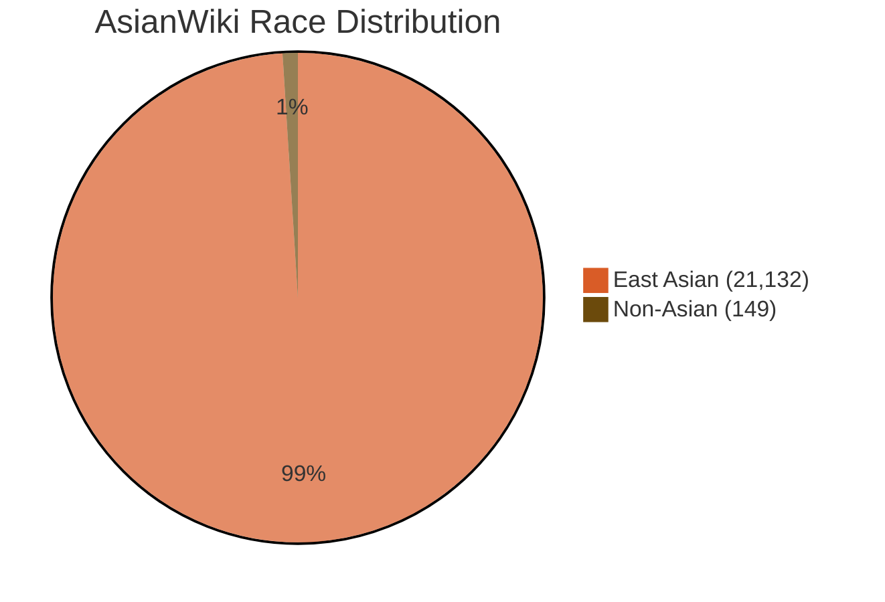
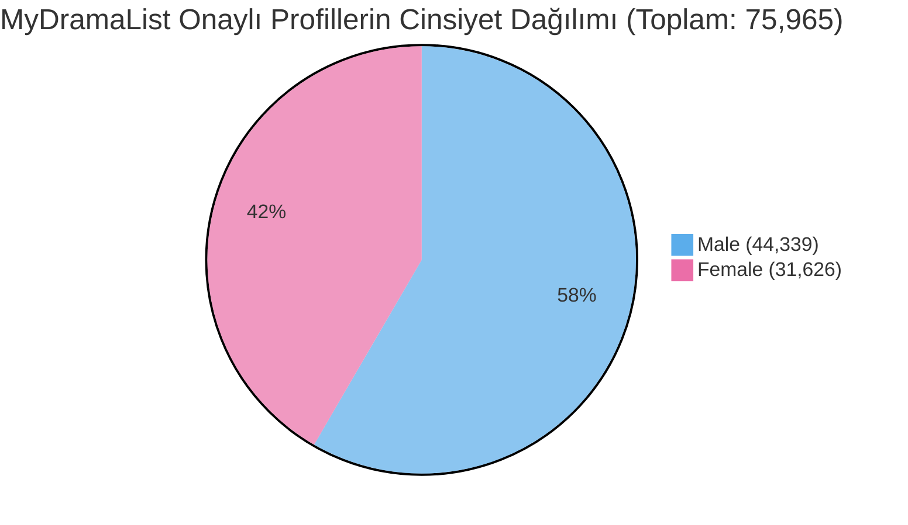

# <center>Asyalı Kişilerin Cinsiyet Tanımlama & Özellik Veri Kümesi <br>(Average Neural Face Embeddings - ANFE)</center>

Web veri kazıma iş akışları, yapılandırılmış aktör/aktris meta veri tabanları ve makalemizde önerilen Ortalama Sinir Ağı Yüz Gömüleri (ANFE) için resmi depo:

> **Gender Classification Using Face Vectors: A Deep Learning Approach Without Classical Models**  
> *Semiha Makinist and Galip Aydin* — **MDPI Information, 2025, 16(7), 531.**  
> DOI: [10.3390/info16070531](https://doi.org/10.3390/info16070531)

---

## 📊 Veri Kümesi İstatistikleri ve Dağılımları

Veri tabanımız iki ana kaynaktan (**AsianWiki** ve **MyDramaList**) toplanmış zengin oyuncu profilleri, drama yapımları ve yüz özelliklerinden oluşmaktadır.

---

### 1. AsianWiki Veri Kümesi İstatistikleri (Toplam: 21,281)

AsianWiki üzerinde yetişkin ve çocuk oyuncular (Kid Female/Male) ayrılarak etiketlenmiş ve ırk ayrımı (Asian / Non-Asian) filtrelenmiştir.

#### 📌 Cinsiyet & Yaş Grubu Dağılımı
* **Adult Male (M):** 11,619 (%54.6)
* **Adult Female (F):** 8,843 (%41.6)
* **Kid Male (KM):** 429 (%2.0)
* **Kid Female (KF):** 390 (%1.8)



#### 📌 Irk / Etnik Dağılımı

#### Table: AsianWiki veri setinde ırk kategorisine göre cinsiyet ve yaş grubu dağılımı.

| Race Category | Female (Adult) | Male (Adult) | Kid Female | Kid Male | Total |
| :--- | :---: | :---: | :---: | :---: | :---: |
| **Asian** | 8,800 | 11,513 | 390 | 429 | **21,132** |
| **Non-Asian** | 43 | 106 | 0 | 0 | **149** |
| **Total** | **8,843** | **11,619** | **390** | **429** | **21,281** |

---

### 2. MyDramaList Veri Kümesi İstatistikleri (Toplam: 75,965)

MyDramaList üzerinden Asya ve uluslararası prodüksiyonlarda yer alan toplam **75.965** profil taranmış ve milliyet bazlı kategorize edilmiştir.

#### 📌 Genel Cinsiyet Dağılımı
* **Male:** 44,339 (%58.37)
* **Female:** 31,626 (%41.63)

```text
Male   [██████████████████████████████████] 58.37% (44,339)
Female [███████████████████████]           41.63% (31,626)
```



---

#### 📌 En Yüksek Temsile Sahip İlk 10 Ülke / Milliyet Dağılımı

```mermaid
%%{init: {
    "theme": "base",
    "themeVariables": {
        "titleColor": "#f8fafc",
        "sectionBkgColor": "#1e293b",
        "altSectionBkgColor": "#0f172a",
        "gridColor": "#334155",
        "lineColor": "#64748b",
        "fontSize": "13px",

        "activeTaskColor": "#93c5fd",
        "activeTaskBorderColor": "#60a5fa",
        "taskTextOutsideColor": "#f8fafc",

        "doneTaskColor": "#c4b5fd",
        "doneTaskBorderColor": "#a78bfa",
        "doneTaskTextColor": "#0f172a",

        "critBkgColor": "#fbcfe8",
        "critBorderColor": "#f472b6",
        "critTextColor": "#0f172a",

        "taskColor": "#bae6fd",
        "taskBorderColor": "#38bdf8",
        "taskTextColor": "#0f172a"
    }
}}%%
gantt
    title En Çok Görülen 7 Milliyet (Doğrulanmış Profiller)
    dateFormat X
    axisFormat %d
    tickInterval 5000

    section Japanese
    21,622 (28.5%) : active, 0, 21622
    section S. Korean
    18,956 (25.0%) : done, 0, 18956
    section Chinese
    17,413 (22.9%) : done, 0, 17413
    section Thai
    6,773 (8.9%)   : crit, 0, 6773
    section Filipino
    3,449 (4.5%)   : 0, 3449
    section Taiwanese
    2,951 (3.9%)   : 0, 2951
    section Hong Konger
    2,887 (3.8%)   : 0, 2887
```



#### Tablo: MyDramaList veri setindeki doğrulanmış oyuncu profillerinin uyruk ve cinsiyet dağılımı.

| Nationality | Total Actors | % of Dataset | Male Count | Female Count | Male / Female Ratio |
| :--- | :---: | :---: | :---: | :---: | :---: |
| 🇯🇵 **Japanese** | 21,622 | 28.34% | 11,787 | 9,835 | 54.5% / 45.5% |
| 🇰🇷 **South Korean** | 18,956 | 24.84% | 11,378 | 7,578 | 60.0% / 40.0% |
| 🇨🇳 **Chinese** | 17,413 | 22.82% | 10,213 | 7,200 | 58.7% / 41.3% |
| 🇹🇭 **Thai** | 6,773 | 8.88% | 4,060 | 2,713 | 59.9% / 40.1% |
| 🇵🇭 **Filipino** | 3,449 | 4.52% | 2,123 | 1,326 | 61.6% / 38.4% |
| 🇹🇼 **Taiwanese** | 2,951 | 3.87% | 1,732 | 1,219 | 58.7% / 41.3% |
| 🇭🇰 **Hong Konger** | 2,887 | 3.78% | 1,769 | 1,118 | 61.3% / 38.7% |
| 🇺🇸 **American** | 775 | 1.02% | 541 | 234 | 69.8% / 30.2% |
| 🇨🇦 **Canadian** | 189 | 0.25% | 130 | 59 | 68.8% / 31.2% |
| 🇬🇧 **British** | 181 | 0.24% | 125 | 56 | 69.1% / 30.9% |
| *Others (67 Countries)* | 1,180 | 1.54% | 684 | 496 | 58.0% / 42.0% |
| **Total** | **76,308** | **100.0%** | **44,555** | **31,753** | **58.4% / 41.6%** |

---

## 📂 Proje Yapısı

```text
Asian-Face-ANFE/
│
├── data/
│   ├── asianwiki/
│   │   ├── cinsiyet_dagilimi-asianwiki_player_infos.json      # Gender statistics
│   │   ├── asianwiki_movie.json                               # AsianWiki movie/drama information
│   │   └── asianwiki_player_infos.json                        # Scraped image URLs and Person Info of celebrities
│   ├── mydramalist/
│   │   ├── gender_distribution-mydramalist_player_infos.json  # Gender statistics
│   │   ├── nationality_count-mydramalist_player_infos.json    # Gender statistics across 77 nationalities
│   │   ├── nationality-mydramalist_player_infos.json          # List of the names of the 77 nationalities included in the dataset
│   │   ├── mydramalist_movie.json                             # AsianWiki movie/drama information
│   │   └── mydramalist_player_infos.json                      # Scraped image URLs and Person Info of celebrities
│   └── embeddings/
│       └── anfe_dlib_arcface_facenet512.json                  # Precomputed ANFE vectors (FaceNet512, ArcFace, dlib)
│
├── scrapers/                                                  # Scraping image datasets from the web
│   ├── setfolder/                                             # Directory management routines
│   ├── tools/                                                 # Auxiliary web scraping utilities
│   ├── units/                                                 # Unit parsers & extraction helpers
│   ├── asianwiki_crawler_collectMainLinks.py                  # Collecting movies and serials on the AsianWiki Main Page 
│   ├── asianwiki_crawler.py                                   # AsianWiki web scraping pipeline
│   ├── asianwikiSavePlayerInfoDB.py                           # AsianWiki database export & serialization 
│   ├── mydramalist_crawler_collectMainLinks.py                # Collecting movies and serials on the MyDramaList Main Page
│   └── mydramalist_crawler.py                                 # MyDramaList crawler pipeline
│
├── src/     
│   ├── charts/                                                # Visualization generation scripts
│   ├── units/                                                 # Core processing helper modules
│   ├── download_images.py                                     # Script to download assets from metadata URLs                                   
│   ├── calculate_anfe.py                                      # Average Neural Face Embedding (ANFE) generator
│   └── evaluate.py                                            # Metrics evaluation & benchmark script
│
├── requirements.txt
├── LICENSE
└── README.md
└── README_en.md
```

---

## 🔬 Sınıflandırma Performansı (Özet)

Model performanslarımız, yalnızca yetişkin bireylerden oluşan 1.000 kadın ve 1.000 erkek Doğu Asyalı test kümesinde değerlendirilmiştir (değerlendirme kümesine çocuk verileri dahil edilmemiştir):

| Model | Embedding Size | Female Acc (%) | Male Acc (%) | Overall Acc (%) | Inference Time (s) |
| :--- | :---: |:--------------:| :---: |:---------------:| :---: |
| **FaceNet512 200-ANFE** | 512D |   **97.50%**   | **94.20%** |   **95.85%**    | **~1s** |
| **ArcFace 200-ANFE** | 512D |     92.80%     | 90.10% |     91.45%      | **~1s** |
| **dlib 200-ANFE** | 128D |     78.60%     | 72.80% |     75.70%      | **~1s** |
| VGG-Face (DeepFace) | 2622D |     88.70%     | 96.80% |     92.75%      | ~260s |
| Small-VGG-Face16 | 128D |     96.40%     | 73.30% |     84.85%      | ~59s |
| Gender-Caffemodel | - |     62.20%     | 88.80% |     75.50%      | ~13s |

---
## ⚖️ Etik ve Veri Erişilebilirliği

Telif hakkı yasalarına ve kişisel veri koruma düzenlemelerine uymak amacıyla, **bu depoda hiçbir ham görüntü dosyası doğrudan barındırılmamaktadır**:
* Bu depo yalnızca herkese açık profil meta verilerini, doğrudan görüntü kaynak URL’lerini ve geri döndürülemez sayısal özellik vektörlerini (ANFE gömüleri) içermektedir.
* Araştırmacılar, ticari olmayan akademik araştırma amaçlarıyla `src/download_images.py` dosyasını kullanarak görüntü varlıklarını yerel olarak indirebilirler.
* Tüm orijinal portre hakları ve görüntü telif hakları, sahiplerinin mülkiyetinde kalır.
---

## 📖 Kaynak Gösterimi
Araştırmanızda bu veri setini, web kazıyıcılarını veya ANFE metodolojisini kullanırsanız, lütfen yayınımıza atıfta bulunun:

```bibtex
@article{makinist2025gender,
  title={Gender Classification Using Face Vectors: A Deep Learning Approach Without Classical Models},
  author={Makinist, Semiha and Aydin, Galip},
  journal={Information},
  volume={16},
  number={7},
  pages={531},
  year={2025},
  publisher={MDPI},
  doi={10.3390/info16070531}
}
```