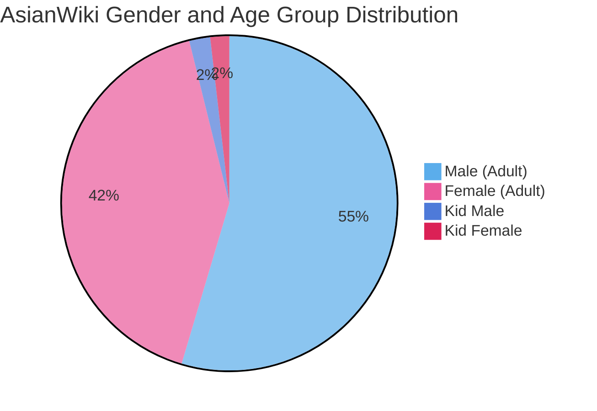
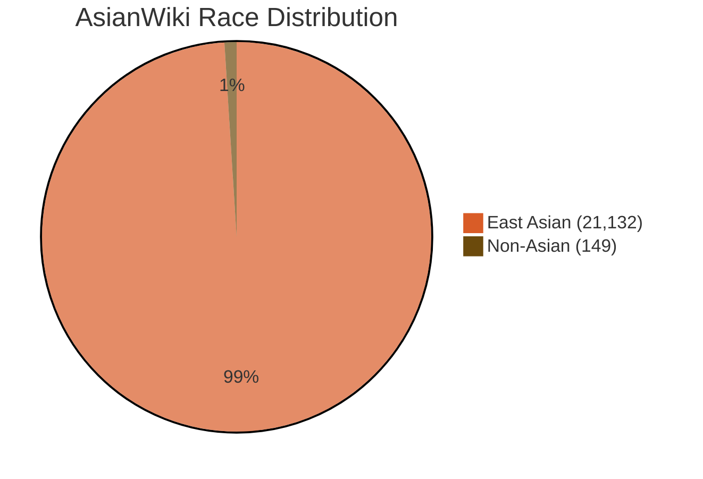
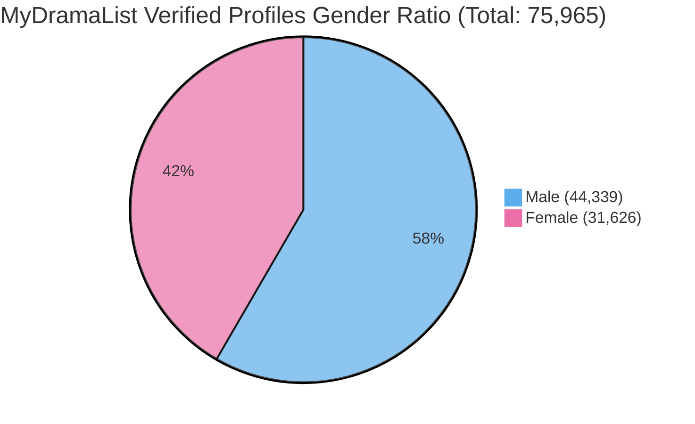

# <center>Asian Gender Recognition & Attribute Dataset <br>(Average Neural Face Embeddings - ANFE)</center>

Official repository for web scraping pipelines, structured actor/actress metadata databases, and Average Neural Face Embeddings (ANFE) proposed in our paper:

> **Gender Classification Using Face Vectors: A Deep Learning Approach Without Classical Models**  
> *Semiha Makinist and Galip Aydin* — **MDPI Information, 2025, 16(7), 531.**  
> DOI: [10.3390/info16070531](https://doi.org/10.3390/info16070531)

---

## 📊 Dataset Statistics & Distributions

Our database comprises extensive actor/actress profiles, drama productions, and facial attributes collected from two primary sources: **AsianWiki** and **MyDramaList**.

---

### 1. AsianWiki Dataset Statistics (Total: 21,281 Records)

Profiles on AsianWiki are categorized by demographic cohorts, distinguishing between adult and child actors (Kid Female/Male) and filtered by ethnicity (East Asian vs. Non-Asian).

**📌 Gender & Age Group Distribution**
* **Adult Male (M):** 11,619 (54.6%)
* **Adult Female (F):** 8,843 (41.6%)
* **Kid Male (KM):** 429 (2.0%)
* **Kid Female (KF):** 390 (1.8%)



**📌 Race / Ethnicity Distribution**


#### Table: Gender and age group distribution by race category in the AsianWiki dataset.

| Race Category | Female (Adult) | Male (Adult) | Kid Female | Kid Male | Total |
| :--- | :---: | :---: | :---: | :---: | :---: |
| **Asian** | 8,800 | 11,513 | 390 | 429 | **21,132** |
| **Non-Asian** | 43 | 106 | 0 | 0 | **149** |
| **Total** | **8,843** | **11,619** | **390** | **429** | **21,281** |

---

### 2. MyDramaList Dataset Statistics (Verified Profiles: 75,965 Records)

A total of **75,965** verified profiles with confirmed portrait imagery (`case: true`) across Asian and international productions were scraped, structured, and indexed by nationality.

**📌 Overall Gender Ratio**
* **Male:** 44,339 (58.37%)
* **Female:** 31,626 (41.63%)

```text
Male   [██████████████████████████████████] 58.37% (44,339)
Female [███████████████████████]           41.63% (31,626)
```



---

**📌 Top Represented Nationalities**

```mermaid
%%{init: {
    "theme": "base",
    "themeVariables": {
        "fontSize": "13px",
        "gridColor": "#cbd5e1",
        "lineColor": "#94a3b8",

        "sectionBkgColor": "rgba(241, 245, 249, 0.6)",
        "altSectionBkgColor": "rgba(255, 255, 255, 0.6)",

        "activeTaskColor": "#bfdbfe",
        "activeTaskBorderColor": "#3b82f6",

        "doneTaskColor": "#ddd6fe",
        "doneTaskBorderColor": "#8b5cf6",
        "doneTaskTextColor": "#0f172a",

        "critBkgColor": "#fbcfe8",
        "critBorderColor": "#ec4899",
        "critTextColor": "#0f172a",

        "taskColor": "#fed7aa",
        "taskBorderColor": "#f97316",
        "taskTextColor": "#0f172a"
    },
    "themeCSS": ".titleText { fill: var(--color-fg-default, #0f172a) !important; font-weight: 700; }.sectionTitle { fill: var(--color-fg-default, #0f172a) !important; font-weight: 600; }.taskText, .taskTextDone, .taskTextCrit { fill: #0f172a !important; font-weight: 600; }.taskTextOutside, .taskTextOutsideRight { fill: var(--color-fg-default, #0f172a) !important; font-weight: 600; }.tick text { fill: var(--color-fg-default, #475569) !important; font-size: 11px; }"
}}%%
gantt
    title Top 7 Nationalities (Verified Profiles)
    dateFormat X
    axisFormat %s

    section Japanese
    21,622 (28.5%) : active, 0, 21622
    section S. Korean
    18,956 (25.0%) : done, 0, 18956
    section Chinese
    17,413 (22.9%) : done, 0, 17413
    section Thai
    6,773 (8.9%)   : crit, 0, 6773
    section Filipino
    3,449 (4.5%)   : 0, 3449
    section Taiwanese
    2,951 (3.9%)   : 0, 2951
    section Hong Konger
    2,887 (3.8%)   : 0, 2887
```



#### Table. Nationality and gender distribution of verified actor profiles in the MyDramaList dataset.

| Nationality | Total Actors | % of Dataset | Male Count | Female Count | Male / Female Ratio |
| :--- | :---: | :---: | :---: | :---: | :---: |
| 🇯🇵 **Japanese** | 21,622 | 28.46% | 11,787 | 9,835 | 54.5% / 45.5% |
| 🇰🇷 **South Korean** | 18,956 | 24.95% | 11,378 | 7,578 | 60.0% / 40.0% |
| 🇨🇳 **Chinese** | 17,413 | 22.92% | 10,213 | 7,200 | 58.7% / 41.3% |
| 🇹🇭 **Thai** | 6,773 | 8.92% | 4,060 | 2,713 | 59.9% / 40.1% |
| 🇵🇭 **Filipino** | 3,449 | 4.54% | 2,123 | 1,326 | 61.6% / 38.4% |
| 🇹🇼 **Taiwanese** | 2,951 | 3.88% | 1,732 | 1,219 | 58.7% / 41.3% |
| 🇭🇰 **Hong Konger** | 2,887 | 3.80% | 1,769 | 1,118 | 61.3% / 38.7% |
| 🇺🇸 **American** | 775 | 1.02% | 541 | 234 | 69.8% / 30.2% |
| 🇨🇦 **Canadian** | 189 | 0.25% | 130 | 59 | 68.8% / 31.2% |
| 🇬🇧 **British** | 181 | 0.24% | 125 | 56 | 69.1% / 30.9% |
| *Others (67 Countries)* | 769 | 1.02% | 481 | 288 | 62.5% / 37.5% |
| **Total (Filtered)** | **75,965** | **100.0%** | **44,339** | **31,626** | **58.4% / 41.6%** |

---

## 📂 Repository Structure

```text
Asian-Face-ANFE/
│
├── data/
│   ├── asianwiki/
│   │   ├── cinsiyet_dagilimi-asianwiki_player_infos.json      # Gender statistics
│   │   ├── asianwiki_movie.json                               # AsianWiki movie/drama information
│   │   └── asianwiki_player_infos.json                        # Scraped image URLs and Person Info of celebrities
│   ├── mydramalist/
│   │   ├── gender_distribution-mydramalist_player_infos.json  # Gender statistics
│   │   ├── nationality_count-mydramalist_player_infos.json    # Gender statistics across 77 nationalities
│   │   ├── nationality-mydramalist_player_infos.json          # List of the names of the 77 nationalities included in the dataset
│   │   ├── mydramalist_movie.json                             # AsianWiki movie/drama information
│   │   └── mydramalist_player_infos.json                      # Scraped image URLs and Person Info of celebrities
│   └── embeddings/
│       └── anfe_dlib_arcface_facenet512.json                  # Precomputed ANFE vectors (FaceNet512, ArcFace, dlib)
│
├── scrapers/                                                  # Scraping image datasets from the web
│   ├── setfolder/                                             # Directory management routines
│   ├── tools/                                                 # Auxiliary web scraping utilities
│   ├── units/                                                 # Unit parsers & extraction helpers            
│   ├── asianwiki_crawler_collectMainLinks.py                  # Collecting movies and serials on the AsianWiki Main Page 
│   ├── asianwiki_crawler.py                                   # AsianWiki web scraping pipeline
│   ├── asianwikiSavePlayerInfoDB.py                           # AsianWiki database export & serialization 
│   ├── mydramalist_crawler_collectMainLinks.py                # Collecting movies and serials on the MyDramaList Main Page
│   └── mydramalist_crawler.py                                 # MyDramaList crawler pipeline
│
├── src/   
│   ├── charts/                                                # Visualization generation scripts
│   ├── units/                                                 # Core processing helper modules
│   ├── download_images.py                                     # Script to download assets from metadata URLs                                   
│   ├── calculate_anfe.py                                      # Average Neural Face Embedding (ANFE) generator
│   └── evaluate.py                                            # Metrics evaluation & benchmark script
│
├── requirements.txt
├── LICENSE
└── README.md
└── README_en.md
```

---

## 🔬 Classification Performance (Summary)

Model performances were evaluated on a balanced test set of 1,000 female and 1,000 male adult East Asian faces (child records were excluded from this evaluation benchmark):

| Model | Embedding Size | Female Acc (%) | Male Acc (%) | Overall Acc (%) | Inference Time (s) |
| :--- | :---: |:--------------:| :---: |:---------------:| :---: |
| **FaceNet512 200-ANFE** | 512D | **97.50%** | **94.20%** | **95.85%** | **~1s** |
| **ArcFace 200-ANFE** | 512D | 92.80% | 90.10% | 91.45% | **~1s** |
| **dlib 200-ANFE** | 128D | 78.60% | 72.80% | 75.70% | **~1s** |
| VGG-Face (DeepFace) | 2622D | 88.70% | 96.80% | 92.75% | ~260s |
| Small-VGG-Face16 | 128D | 96.40% | 73.30% | 84.85% | ~59s |
| Gender-Caffemodel | - | 62.20% | 88.80% | 75.50% | ~13s |

---

## ⚖️ Ethics & Data Availability

To comply with copyright laws and personal data protection regulations, **no raw image files are directly hosted in this repository**:
* This repository contains only public profile metadata, direct image source URLs, and irreversible numeric feature vectors (ANFE embeddings).
* Researchers can download image assets locally for non-commercial academic research using `src/download_images.py`.
* All original portrait rights and image copyrights remain the property of their respective creators and hosting agencies. If you believe any URL infringes upon your copyright, please open an issue for immediate removal.

---

## 📖 Citation

If you use this dataset, web scrapers, or the ANFE methodology in your research, please cite our publication:

```bibtex
@article{makinist2025gender,
  title={Gender Classification Using Face Vectors: A Deep Learning Approach Without Classical Models},
  author={Makinist, Semiha and Aydin, Galip},
  journal={Information},
  volume={16},
  number={7},
  pages={531},
  year={2025},
  publisher={MDPI},
  doi={10.3390/info16070531}
}
```
